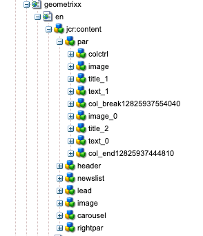

## About

This conversion tool is used to manipulate the structure of a page from a *Static* definition, to an *Editable Template*. The intent is to help customers move from the limited capabilities of the legacy features to the robust, modern AEM offerings.

The operations referenced here are performed on the content in the repository, this tool does not modify any code. There is an implicit expectation that a new Editable Template has been created to support the content updated by these conversions. See the <a href="{{ site.baseurl }}/pages/plan-operate.html">Plan & Operate</a> section for more information.

Here you'll find information on what conversion operations occur. For information on how to configure the tool, see the associated <a href="{{ site.baseurl }}/pages/configuration/page-structure.html">configuration page</a>. For information on how the services perform the changes, and options for extending or enhancing, see the <a href="{{ site.baseurl }}/pages/development.html">developer detail pages.</a>

## Conversions

This tool performs the most transformations, although none of them are very complex. 

### Root Responsive Grid

    

        
Static templates are based on embedded components, the template defines the order and structure through code. The image on the right shows the structure of the Geometrixx Shapes home page. You'll see that there a number of components embedded in the template itself.

        
However, standard Editable Templates use a responsive grid container at their root, to contain the base template structure. <i>Therefore, the first step of conversion is to create a new <strong>Responsive Grid</strong> component, with the node name of <code>root</code></i>.
     
    

    

        
            
        
    
  

### Content Relocation

Once the `root` node is created, the next conversion step is to move all of the existing nodes to the newly created parent. The components are moved over in the order specified in the OSGi Configuration for the template. This reordering is necessary to ensure the same display order as was previously managed by the static template.

### Node Renaming

While moving the static node structure to the new root layout container, the nodes may require renaming. This is again due to the inherit difference in the static structure to the editable template layout. The static structure likely relied on nodes named *parsys*, whereas an editable template uses layout containers which are named *responsivegrid* or some derivation thereof. Node renaming is configured in the OSGi service definition. 

### Parsys => Layout Container

While the legacy Paragraph System Component will continue to render the contained content, it cannot be updated with new content. Therefore, the entire tree of nodes is modified to replace all parsys' references with layout containers. All content order is maintained during this transformation.

### Column Control => Layout Containers

As with the parsys, the Column Control is a legacy component, and while fully functional, it doesn't fit with the Responsive Grid/Layout Container design. This conversion creates a layout container for each column, and moves all of the components, order preserved. Each layout container is set on the responsive grid to be the original column width of the column control for all breakpoints.  

### Content Removal

Since static templates function via code defined paths, the are times when a template update creates orphaned content. The only way to remove this content is to do it manually. This conversion allows specified nodes to be deleted during the transformation process.
